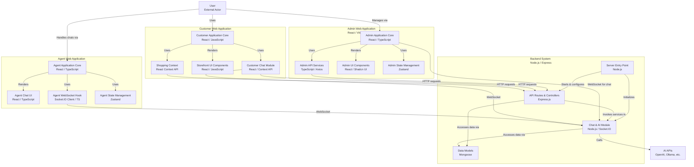

# Sistema Chat-AI – Presentación Técnica

> **Versión:** 1.0 · **Fecha:** 12-jun-2025  
> **Autor:** Eduardo Tnc · **Proyecto:** Plataforma de pedidos con asistente de IA y atención humana

---

## 1. Resumen General
El proyecto **Restaurant Delivery AI** es una plataforma completa para pedidos de comida que integra:

* **Aplicación cliente** donde los usuarios pueden explorar el menú, comprar y chatear con un asistente de IA o con agentes humanos.
* **Aplicación de agentes** que permite a operadores humanos atender chats escalados.
* **Aplicación de administración** para gestionar catálogo, usuarios, órdenes, modelos de IA y llaves API.
* **Backend** Node.js que expone API REST y comunicación en tiempo real mediante Socket.IO, además de orquestar servicios de IA (OpenAI u Ollama).

El sistema está preparado para escalar conversaciones a un agente humano cuando la IA no resuelva la consulta o cuando el usuario lo solicite.

---

## 2. Tecnologías y Librerías Principales
| Capa | Tecnologías | Paquetes Destacados |
|------|-------------|----------------------|
| **Backend** | Node.js 20 · Express 5 · Socket.IO 4 · MongoDB/Mongoose 8 | `openai`, `socket.io`, `dotenv`, `jsonwebtoken`, `multer`, `jest`, `supertest` |
| **Cliente web** | React 19 · Vite 6 · TailwindCSS 4 | `axios`, `socket.io-client`, `react-router-dom`, `react-toastify`, `framer-motion` |
| **Agente** | React 19 + TypeScript · Zustand | `socket.io-client`, `zustand` |
| **Admin** | React 19 + TypeScript · Shadcn UI · Radix UI | `axios`, `zustand`, `@radix-ui/*`, `lucide-react`, `tailwind-merge` |
| **Pruebas** | Jest 30 · Supertest · mongodb-memory-server |

---

## 3. Arquitectura de Alto Nivel


---

## 4. Estructura de Carpetas (extracto)
```
Chat-AI/
├── server/           # Backend Node.js + Express
├── frontend-cliente/ # Aplicación cliente (React JS)
├── frontend-agent/   # Aplicación de agentes (React TS)
├── frontend-admin/   # Aplicación de administración (React TS)
└── chat-module-docs/ # Diagramas Mermaid & WSD
```
*(Ver árbol completo al inicio del documento del usuario)*

---

## 5. Backend
### 5.1 Servidor Express
* **Archivo de entrada:** `server/server.js` – configura Express, CORS, conexión a MongoDB y Socket.IO.
* **Rutas REST** en `server/routes/*` mapean a **controladores** en `server/controllers/*`.
* **Autenticación:** JWT, gestionada por `authMiddleware.js` (HTTP) y `socketAuthMiddleware.js` (WebSocket).
* **Subidas de archivos:** `multer` para imágenes de menú.

### 5.2 Módulo Chat & IA (`server/chat-module`)
* **services/AIService.js**  
  Gestiona llamadas a modelos de IA, define **tool calls** (`search_menu_items`, `escalate_to_human_agent`) y maneja la lógica de conversación.
* **services/MessageService.js**  
  CRUD de mensajes y conversaciones, verificación de permisos.
* **providers/**  
  Abstracción para **OpenAIProvider** y **OllamaProvider**.
* **socketHandlers/**  
  Lógica de eventos para usuarios, agentes y IA.

### 5.3 Modelos Mongoose
`User`, `Conversation`, `Message`, `MenuItem`, `Order`, `AIModelConfig`, `ApiKeyStore`.

### 5.4 Pruebas
Carpeta `server/__tests__` con suites `*.integration.test.js` ejecutadas vía Jest + Supertest.

---

## 6. Frontend Cliente (`frontend-cliente`)
* **Stack:** React 19, Vite, TailwindCSS, Context API.
* **Gestión de estado:** Contexts `AuthContext`, `ChatContext`, `TiendaContext`.
* **Socket.IO:** Hook `ChatSocket.js` gestiona mensajes, typing y eventos de IA.
* **Páginas principales:** Inicio, Tomar Orden, Carrito, Mis Órdenes, Chat.
* **Componentes de Chat:** Área de conversaciones, búsqueda de usuarios, chat con IA (`AIAssistantChat`).

---

## 7. Frontend Agente (`frontend-agent`)
* **Stack:** React 19 + TypeScript, Zustand para estado, Tailwind.
* **WebSocket:** Hook `useAgentSocket.ts` para cola y mensajes.
* **Componentes clave:** `ConversationQueue`, `MessageArea`, `ConversationDetails`.

---

## 8. Frontend Admin (`frontend-admin`)
* **Stack:** React 19 + TypeScript, Shadcn UI (Radix), Zustand.
* **Servicios API:** `aiModelService.ts`, `menuItemService.ts`, etc. usando Axios.
* **Gestión de modelos de IA y llaves API.**
* **Chat completo** para visualizar y moderar conversaciones (`FullChatPage.tsx`).

---

## 9. Flujo de Chat y Escalada
1. **Cliente envía mensaje** → evento `sendMessageToIA` por Socket.IO.  
2. **AISocketHandler** crea mensaje, llama a **AIService**.  
3. **AIService** decide:  
   * Responder directamente (`newMessageFromIA`).  
   * Ejecutar tool call `search_menu_items` → consulta BD y responde.  
   * Ejecutar `escalate_to_human_agent` → `MessageService.escalateConversationToAgent` notifica a agentes, UI muestra "Escalación en progreso".
4. **Agente** recibe conversación en cola y responde al usuario.

---

## 10. Configuración de Entorno
| Variable | Descripción |
|----------|-------------|
| `MONGO_URI` | Cadena de conexión a MongoDB |
| `JWT_SECRET` | Clave JWT para firmas |
| `OPENAI_API_KEY` | API Key si se usa OpenAI |
| `OLLAMA_URL` | URL local/remota de instancia Ollama |

Ejecutar:
```bash
pnpm i          # instala dependencias en cada paquete
pnpm --filter ./server dev       # backend con nodemon
pnpm --filter ./frontend-cliente dev   # cliente
pnpm --filter ./frontend-agent dev     # agente
pnpm --filter ./frontend-admin dev     # admin
```

---

## 11. Diagramas Adicionales
En `chat-module-docs/` se incluyen diagramas **PlantUML (.wsd)** de casos de uso, clases y secuencia.

---

## 12. Contribución y Pruebas
1. Crear branch y PR.  
2. Correr `pnpm test` en `server/` para asegurar pruebas verdes.  
3. Agregar tests si se añaden rutas o lógica.

---

## 13. Futuras Mejoras
* Despliegue continuo (Docker + CI).  
* Internationalization (i18n).  
* Soporte multicanal (WhatsApp, Messenger).  
* Analítica de conversaciones y feedback de usuarios.

---

> ¡Listo! Esta presentación sirve como entrada rápida para nuevos desarrolladores y stakeholders.
