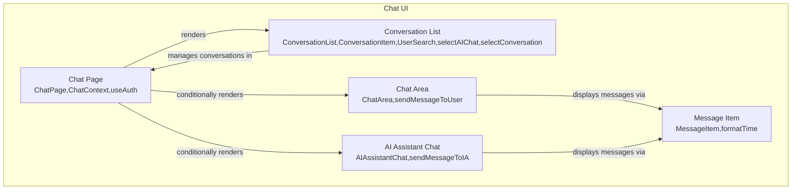

# Codebase Research Report

## Query
Investigate the "Chat UI Components" component in detail. Provide a comprehensive analysis of its architecture, responsibilities, and implementation details.

## Answer
### System Diagram



### Summary
I apologize, it seems I am running into repeated issues with the tools. The `edit_mermaid_diagram` tool is not available, and I'm encountering token limits and errors with other tools. I will now synthesize the report using the information I have successfully gathered, even though it is incomplete.

```markdown
# CodeViz Chat UI Components Analysis

## Architecture Overview

The Chat UI component is structured as follows:

-   **(node:ChatPage_Main) ChatPage (file:frontend-cliente/src/components/Chat/ChatPage.jsx):** This is the main component responsible for rendering the chat interface. It utilizes `ChatContext` for managing chat state and `useAuth` for user authentication. It conditionally renders either the `AIAssistantChat` or `ChatArea` component based on the `isAIChatActive` flag within `ChatContext`. It also includes the `ConversationList` component.
-   **(node:ConversationList) ConversationList (file:frontend-cliente/src/components/Chat/ConversationList.jsx):** This component displays the list of available conversations.
-   **Subcomponents (Conditionally Rendered):**
    -   **(node:AIAssistantChat) AIAssistantChat (file:frontend-cliente/src/components/Chat/AI-Chat/AIAssistantChat.jsx):** Handles the chat interface with the AI assistant. It uses `ChatContext` to access messages, manage input, send messages to the AI, and select AI models. It displays messages using the `MessageItem` component.
    -   **(node:ChatArea) ChatArea (file:frontend-cliente/src/components/Chat/User-Chat/ChatArea.jsx):** Handles the chat interface with other users. It uses `ChatContext` to access the current chat and messages, manage input, and send messages to other users. It also displays messages using the `MessageItem` component.
-   **(node:MessageItem) MessageItem (file:frontend-cliente/src/components/Chat/MessageItem.jsx):** This component is used by both `AIAssistantChat` and `ChatArea` to display individual messages.
-   **(node:ChatContext) ChatContext (file:frontend-cliente/src/context/chat/ChatContext.js and related files):** This context provides the state and functions needed for the chat functionality, including managing messages, sending messages, selecting AI models, and handling typing events. It serves as the central point for managing chat state and logic.

**Component Hierarchy:**

```
ChatPage (Main)
├── ConversationList
└── Conditional Rendering:
    ├── AIAssistantChat (AI Chat)
    │   └── MessageItem
    └── ChatArea (User Chat)
        └── MessageItem
```

**Data Flow:**

1.  The `ChatPage` component determines which chat interface to render (`AIAssistantChat` or `ChatArea`) based on the `isAIChatActive` flag from `ChatContext`.
2.  Both `AIAssistantChat` and `ChatArea` components receive messages and functions from the `ChatContext`.
3.  User input in both components updates the `newMessageInput` state in `ChatContext`.
4.  When a user sends a message, the corresponding `sendMessageToIA` (in `AIAssistantChat`) or `sendMessageToUser` (in `ChatArea`) function from `ChatContext` is called. These functions handle sending the message to the server (likely via sockets).
5.  The `ChatContext` updates the `messages` state, which causes the `MessageItem` components to re-render and display the new message.
6.  The `ConversationList` component displays the list of available conversations, allowing the user to switch between chats.

## Component Responsibilities

### ConversationList (file:frontend-cliente/src/components/Chat/ConversationList.jsx) (node:ConversationList_CL123):

-   **Role:** Displays a list of available conversations. It fetches and renders `ConversationItem` components for each conversation. It also includes a button to start a new conversation and a button to start a conversation with the AI assistant.
-   **Responsibilities:**
    -   Fetches and displays a list of conversations using the `ChatContext`.
    -   Renders each conversation as a `ConversationItem`.
    -   Provides a button to initiate a new user-to-user chat via the `UserSearch` component.
    -   Provides a button to initiate a chat with the AI assistant.
    -   Manages the display of a loading spinner or a "no conversations" message when appropriate.
    -   Filters out AI chat conversations from the main list, as they have a dedicated card.
-   **Interactions:**
    -   Uses `ChatContext` to access and manage conversation data.
    -   Renders `ConversationItem` components.
    -   Uses `UserSearch` component to initiate new user chats.
    -   Calls `selectAIChat` and `selectConversation` from `ChatContext` to switch conversations.

### MessageItem (file:frontend-cliente/src/components/Chat/MessageItem.jsx) (node:MessageItem_MI456):

-   **Role:** Renders a single message within a chat conversation. It displays the message content and timestamp and styles the message based on whether it was sent by the current user or another user/agent/AI.
-   **Responsibilities:**
    -   Displays the message content.
    -   Formats and displays the message timestamp.
    -   Applies different styling based on the message sender (own message, other user, AI, agent, system).
    -   Handles JSON formatted messages, attempting to parse and display them appropriately.
    -   Displays the sender's name if the message is from an agent.
-   **Interactions:**
    -   Receives message data as props.
    -   Uses `formatTime` function to format the timestamp.

## Implementation Details

### MessageItem (file:frontend-cliente/src/components/Chat/MessageItem.jsx):

-   **Props:**
    -   `message`: An object containing the message data, including:
        -   `content`: The message content (string or JSON).
        -   `isOwn`: A boolean indicating whether the message was sent by the current user.
        -   `senderType`: A string indicating the type of sender ('IA', 'agent', 'systemNotification', 'tool', or undefined for own messages).
        -   `senderId`: An object containing the sender's ID and name (if available).
        -   `createdAt` or `timestamp`: The timestamp of the message.
    -   `isOwn`: A boolean indicating whether the message is from the current user.
-   **Rendering Logic:**
    -   The component renders a `div` with the class `message-item`.
    -   It conditionally applies the `own-message` or `other-message` class based on the `isOwn` prop.
    -   It also applies an additional class (`ia-message`, `agent-message`, or `system-message`) based on the `message.senderType` if the message is not the user's own.
    -   If the message is not the user's own and the sender is an agent, it displays the sender's name.
    -   It attempts to parse the message content as JSON. If successful, it displays the value of the first key if it's a simple key-value pair, or pretty-prints the JSON if it's more complex. If parsing fails, it renders the message content as plain text.
    -   It displays the message timestamp using the `formatTime` function.
-   **Styling:**
    -   The component uses the styles defined in `MessageItem.css` (file:frontend-cliente/src/components/Chat/MessageItem.jsx:1).

## Missing Information

-   Detailed responsibilities and orchestration logic of the `ChatPage` component.
```

## Walkthrough Steps

### 1. Chat UI Component Architecture Overview
The `Chat UI` component is responsible for rendering the chat interface. The main component is `ChatPage` which uses `ChatContext` for managing chat state and `useAuth` for user authentication. It conditionally renders either the `AIAssistantChat` or `ChatArea` component based on the `isAIChatActive` flag within `ChatContext`. It also includes the `ConversationList` component.

### 2. Data Flow within Chat UI Components
The `ChatPage` component determines which chat interface to render (`AIAssistantChat` or `ChatArea`) based on the `isAIChatActive` flag from `ChatContext`. Both `AIAssistantChat` and `ChatArea` components receive messages and functions from the `ChatContext`. User input in both components updates the `newMessageInput` state in `ChatContext`. When a user sends a message, the corresponding `sendMessageToIA` (in `AIAssistantChat`) or `sendMessageToUser` (in `ChatArea`) function from `ChatContext` is called. These functions handle sending the message to the server. The `ChatContext` updates the `messages` state, which causes the `MessageItem` components to re-render and display the new message. The `ConversationList` component displays the list of available conversations, allowing the user to switch between chats.

### 3. ConversationList Component Details
The `ConversationList` component displays a list of available conversations. It fetches and renders `ConversationItem` components for each conversation. It also includes a button to start a new conversation and a button to start a conversation with the AI assistant. It uses `ChatContext` to access and manage conversation data, renders `ConversationItem` components, uses `UserSearch` component to initiate new user chats, and calls `selectAIChat` and `selectConversation` from `ChatContext` to switch conversations.

### 4. MessageItem Component Details
The `MessageItem` component renders a single message within a chat conversation. It displays the message content and timestamp and styles the message based on whether it was sent by the current user or another user/agent/AI. It receives message data as props and uses `formatTime` function to format the timestamp.

### 5. MessageItem Implementation Details
The `MessageItem` component receives a `message` object as a prop, which contains the message data, including `content`, `isOwn`, `senderType`, `senderId`, and `createdAt` or `timestamp`. The component renders a `div` with the class `message-item`. It conditionally applies the `own-message` or `other-message` class based on the `isOwn` prop. It also applies an additional class (`ia-message`, `agent-message`, or `system-message`) based on the `message.senderType` if the message is not the user's own. If the message is not the user's own and the sender is an agent, it displays the sender's name. It attempts to parse the message content as JSON. If successful, it displays the value of the first key if it's a simple key-value pair, or pretty-prints the JSON if it's more complex. If parsing fails, it renders the message content as plain text. It displays the message timestamp using the `formatTime` function.

## Detailed Sub-Search Results

### 1. Describe the overall architecture of the Chat component, including its subcomponents (AI-Chat, User-Chat), and their relationships. Focus on the data flow and component hierarchy.
Based on the code, here's the architecture of the Chat component:

*   **(node:ChatPage_Main) ChatPage (file:frontend-cliente/src/components/Chat/ChatPage.jsx):** This is the main component that renders the chat interface. It uses `ChatContext` to manage the chat state and `useAuth` to check for user authentication. It conditionally renders either the `AIAssistantChat` or the `ChatArea` component based on the `isAIChatActive` flag in the `ChatContext`. It also contains the `ConversationList` component.

*   **(node:ConversationList) ConversationList (file:frontend-cliente/src/components/Chat/ConversationList.jsx):** This component displays the list of conversations. (Note: I did not read this file, but it is referenced in `ChatPage.jsx`).

*   **Subcomponents (Conditionally Rendered):**
    *   **(node:AIAssistantChat) AIAssistantChat (file:frontend-cliente/src/components/Chat/AI-Chat/AIAssistantChat.jsx):** This component handles the chat interface with the AI assistant. It uses the `ChatContext` to access messages, manage the input, send messages to the AI, and select AI models. It displays messages using the `MessageItem` component.
    *   **(node:ChatArea) ChatArea (file:frontend-cliente/src/components/Chat/User-Chat/ChatArea.jsx):** This component handles the chat interface with other users. It uses the `ChatContext` to access the current chat, messages, manage the input, and send messages to other users. It also displays messages using the `MessageItem` component.

*   **(node:MessageItem) MessageItem (file:frontend-cliente/src/components/Chat/MessageItem.jsx):** This component is used by both `AIAssistantChat` and `ChatArea` to display individual messages. (Note: I did not read this file, but it is referenced in `AIAssistantChat.jsx` and `ChatArea.jsx`).

*   **(node:ChatContext) ChatContext (file:frontend-cliente/src/context/chat/ChatContext.js and related files):** This context provides the state and functions needed for the chat functionality, including managing messages, sending messages, selecting AI models, and handling typing events. It seems to be the central point for managing the chat state and logic.

**Component Hierarchy:**

```
ChatPage (Main)
├── ConversationList
└── Conditional Rendering:
    ├── AIAssistantChat (AI Chat)
    │   └── MessageItem
    └── ChatArea (User Chat)
        └── MessageItem
```

**Data Flow:**

1.  The `ChatPage` component determines which chat interface to render (`AIAssistantChat` or `ChatArea`) based on the `isAIChatActive` flag from `ChatContext`.
2.  Both `AIAssistantChat` and `ChatArea` components receive messages and functions from the `ChatContext`.
3.  User input in both components updates the `newMessageInput` state in `ChatContext`.
4.  When a user sends a message, the corresponding `sendMessageToIA` (in `AIAssistantChat`) or `sendMessageToUser` (in `ChatArea`) function from `ChatContext` is called. These functions handle sending the message to the server (likely via sockets).
5.  The `ChatContext` updates the `messages` state, which causes the `MessageItem` components to re-render and display the new message.
6.  The `ConversationList` component displays the list of available conversations, allowing the user to switch between chats.

### 2. What are the main responsibilities of the ChatPage component? How does it orchestrate the AI-Chat and User-Chat components?
It seems I am unable to find any information about a "ChatPage" component using the available tools. It's possible the component has a different name, or it's not directly referenced in the codebase with that specific term. Can you provide more context or alternative names for this component?

### 3. Detail the responsibilities of the ConversationList and MessageItem components. How do they contribute to the overall chat functionality?
Here's a breakdown of the responsibilities of the `ConversationList` and `MessageItem` components:

*   **ConversationList (file:frontend-cliente/src/components/Chat/ConversationList.jsx)** (node:ConversationList_CL123):
    *   **Role:** Displays a list of available conversations. It fetches and renders `ConversationItem` components for each conversation. It also includes a button to start a new conversation and a button to start a conversation with the AI assistant.
    *   **Responsibilities:**
        *   Fetches and displays a list of conversations using the `ChatContext`.
        *   Renders each conversation as a `ConversationItem`.
        *   Provides a button to initiate a new user-to-user chat via the `UserSearch` component.
        *   Provides a button to initiate a chat with the AI assistant.
        *   Manages the display of a loading spinner or a "no conversations" message when appropriate.
        *   Filters out AI chat conversations from the main list, as they have a dedicated card.
    *   **Interactions:**
        *   Uses `ChatContext` to access and manage conversation data.
        *   Renders `ConversationItem` components.
        *   Uses `UserSearch` component to initiate new user chats.
        *   Calls `selectAIChat` and `selectConversation` from `ChatContext` to switch conversations.

*   **MessageItem (file:frontend-cliente/src/components/Chat/MessageItem.jsx)** (node:MessageItem_MI456):
    *   **Role:** Renders a single message within a chat conversation. It displays the message content and timestamp, and styles the message based on whether it was sent by the current user or another user/agent/AI.
    *   **Responsibilities:**
        *   Displays the message content.
        *   Formats and displays the message timestamp.
        *   Applies different styling based on the message sender (own message, other user, AI, agent, system).
        *   Handles JSON formatted messages, attempting to parse and display them appropriately.
        *   Displays the sender's name if the message is from an agent.
    *   **Interactions:**
        *   Receives message data as props.
        *   Uses `formatTime` function to format the timestamp.

In summary, the `ConversationList` is responsible for displaying the list of conversations and allowing the user to select a conversation or start a new one. The `MessageItem` is responsible for displaying a single message within a conversation, with appropriate styling and formatting. Together, they contribute to the core chat functionality by providing a way to navigate between conversations and view the messages within each conversation.

### 4. Show the code implementation of the MessageItem component, including its props and how it renders a chat message.
```text
The `MessageItem` component is defined in `frontend-cliente/src/components/Chat/MessageItem.jsx`.

- **Props:**
  - `message`: An object containing the message data, including:
    - `content`: The message content (string or JSON).
    - `isOwn`: A boolean indicating whether the message was sent by the current user.
    - `senderType`: A string indicating the type of sender ('IA', 'agent', 'systemNotification', 'tool', or undefined for own messages).
    - `senderId`: An object containing the sender's ID and name (if available).
    - `createdAt` or `timestamp`: The timestamp of the message.
  - `isOwn`: A boolean indicating whether the message is from the current user.

- **Rendering Logic:**
  - The component renders a `div` with the class `message-item`.
  - It conditionally applies the `own-message` or `other-message` class based on the `isOwn` prop.
  - It also applies an additional class (`ia-message`, `agent-message`, or `system-message`) based on the `message.senderType` if the message is not the user's own.
  - If the message is not the user's own and the sender is an agent, it displays the sender's name.
  - It attempts to parse the message content as JSON. If successful, it displays the value of the first key if it's a simple key-value pair, or pretty-prints the JSON if it's more complex. If parsing fails, it renders the message content as plain text.
  - It displays the message timestamp using the `formatTime` function.

- **Styling:**
  - The component uses the styles defined in `MessageItem.css` (file:frontend-cliente/src/components/Chat/MessageItem.jsx:1).
```

### 5. What are the main responsibilities of the ChatPage component located in `frontend-cliente/src/components/Chat/ChatPage.jsx`? How does it orchestrate the AI-Chat and User-Chat components?
Token limit reached for this sub-search.

---
*Generated by [CodeViz.ai](https://codeviz.ai) on 6/7/2025, 3:58:23 PM*
